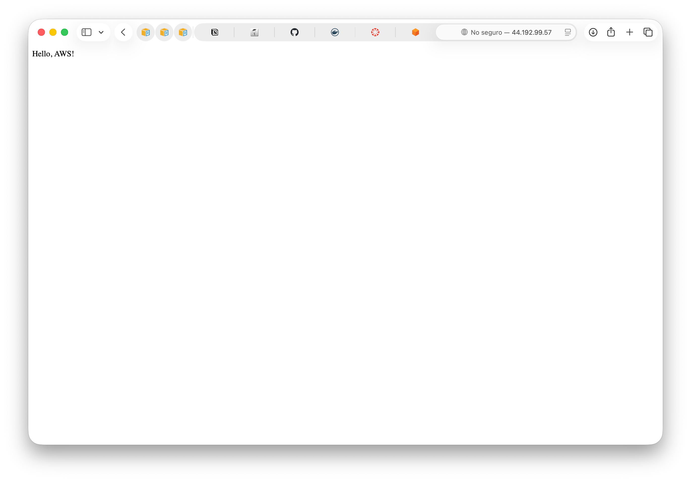
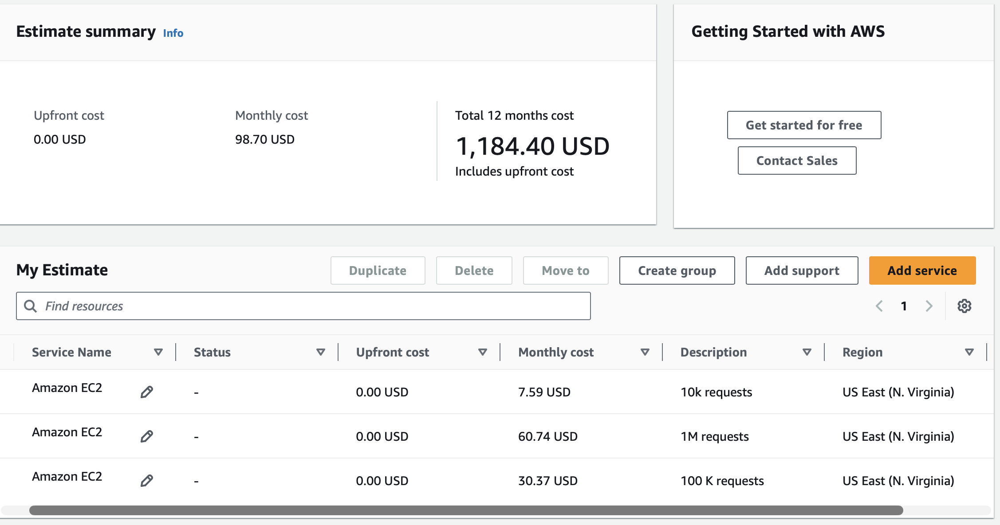

# Virtualization Lab

**Virtualization Lab** is a workshop for the 
**Enterprise Architectures** course at 
**Escuela Colombiana de Ingeniería Julio Garavito**. 
The project takes a minimal **Spring Boot** web application and walks 
it through the complete containerization and deployment lifecycle: running 
it locally, packaging it as a **Docker** image, orchestrating a 
multi-container environment with **Docker Compose**, publishing the image 
to **Docker Hub**, and deploying it on an **Amazon EC2** 

## Project structure

```text
WorkshopImplementation/
├── .gitignore
├── README.md
├── pom.xml
├── Dockerfile
├── compose.yaml
├── docs/
│   ├── cost/
│   │   └── estimate.pdf
│   └── images/
│       ├── deployment-model.png
│       ├── local/
│       ├── docker/
│       ├── compose/
│       ├── dockerhub/
│       ├── ec2/
│       └── cost/
└── src/
    └── main/
        └── java/
            └── eci/arem/
                ├── RestServiceApplication.java
                └── controller
                    ├── HelloRestController.java
```


## Dockerfile explained

```dockerfile
FROM amazoncorretto:25
WORKDIR /app
COPY target/*.jar app.jar
ENV PORT=9000
EXPOSE 9000
ENTRYPOINT ["java", "-jar", "app.jar"]
```

| Instruction                 | Meaning                                                                                                                                                              |
|-----------------------------|----------------------------------------------------------------------------------------------------------------------------------------------------------------------|
| `FROM amazoncorretto:25`    | Base image with the Java 25 runtime. It is published for both `linux/amd64` and `linux/arm64`.                                                                       |
| `WORKDIR /app`              | Creates `/app` and makes it the current directory. Relative paths in the following instructions resolve against it, so the jar ends up in `/app/app.jar`.            |
| `COPY target/*.jar app.jar` | Copies the packaged jar into the image. The jar must exist, so `mvn clean package` runs before `docker build`.                                                       |
| `ENV PORT=9000`             | Defines an environment variable that the **application** reads to choose its port. It can be overridden at runtime with `-e PORT=...`.                               |
| `EXPOSE 9000`               | **Documentation only.** It tells users which port the app listens on, but it does not publish the port. Publishing is done with `-p host:container` in `docker run`. |
| `ENTRYPOINT [...]`          | Command executed when the container starts. It runs from `/app`, so `app.jar` is found.                                                                              |

## Prerequisites

- **Java 25** (JDK) to compile the application.
- **Maven 3.9+** to package the project.
- **Docker Desktop** (or Docker Engine) with **Docker Compose v2** and **buildx**.
- A **Docker Hub** account.

## How to create and run a Docker image

The image is built for two CPU architectures so it runs natively 
both on a linux or MacOS (`linux/arm64`) and on an 
x86 EC2 instance such as `t3.micro` (`linux/amd64`). 
Both variants are published under the **same tag**, 
and each machine automatically pulls the one that matches its processor.


1. Log in to Docker Hub:

```bash
docker login
```

2. Build the image and push it to Docker Hub:

```bash
docker buildx build --platform linux/amd64,linux/arm64 -t ccastano46/arem:latest --push .
```
The image now is published, you can pull it from Docker Hub 

```bash
docker pull ccastano46/arem:tagname
```


3. Inspect the image:

```bash
docker images
```


4. Run the image in a container:

```bash
docker run -d -p 35000:9000 --name arem-docker ccastano46/arem:latest
docker ps
```

5. Test the service:

```text
http://localhost:35000/greeting?name=Container
```


6. Run one additional instances of the same image:

```bash
docker run -d -p 34000:9000 --name arem-docker-2 ccastano46/arem:latest
```

Each container listens on port `9000` internally without conflicts, 
because every container has its own isolated network namespace. 

```text
http://localhost:35000/greeting?name=Container2
http://localhost:34000/greeting?name=Container3
```


Stop and remove the containers:

```bash
docker rm -f arem-docker arem-docker-2
```

## Multi-container environment with Docker Compose

The web application and MongoDB run in separate containers on the same Docker 
network. The application does not persist data in MongoDB yet; 
the database service is included to show how Compose manages 
multiple services, networking, port mappings, and persistent volumes.

```yaml
services:
   web:
      build:
         context: .
         dockerfile: Dockerfile
      container_name: virtualization-web
      environment:
         SERVER_PORT: 9000
         SPRING_DATA_MONGODB_URI: mongodb://db:27017/workshop
      ports:
         - "8087:9000"
      depends_on:
         db:
            condition: service_healthy

   db:
      image: mongo:8
      container_name: virtualization-db
      volumes:
         - mongodb:/data/db
         - mongodb_config:/data/configdb
      ports:
         - "27017:27017"
      healthcheck:
         test: ["CMD", "mongosh", "--quiet", "--eval", "db.adminCommand('ping')"]
         interval: 5s
         timeout: 5s
         retries: 10

volumes:
   mongodb:
   mongodb_config:
```

| Element                    | Meaning                                                                                                                             |
|----------------------------|-------------------------------------------------------------------------------------------------------------------------------------|
| `build`                    | Compose builds the `web` image from the local `Dockerfile`. The jar must be packaged first with `mvn clean package`.               |
| `mongodb://db:27017`       | Compose creates a network where services find each other by service name, so `web` reaches MongoDB through the hostname `db`.      |
| `8087:9000`                | The web application is reachable on `localhost:8087`.                                                                              |
| `depends_on`               | Starts `db` before `web`. It waits for the container to start, not for MongoDB to be ready to accept connections.                  |
| `mongodb`, `mongodb_config`| Named volumes. The data survives when the containers are removed.                                                                  |

Start both services:

```bash
mvn clean package
docker compose up -d --build
```


Verify that Docker created both containers:

```bash
docker compose ps
```


Inspect the logs

```bash
docker compose logs web
docker compose logs db
```


Verify the web application:

Connect to MongoDB from inside its container:

```bash
docker compose exec db mongosh
```

Inside the MongoDB shell, run:

```javascript
show dbs
use workshop
db.messages.insertOne({ message: "Hello from Docker Compose" })
db.messages.find()
exit
```


Stop and remove the containers while preserving the database volumes:

```bash
docker compose down
```

To remove the containers and delete the stored MongoDB data:

```bash
docker compose down -v
```

Verify that the volumes were removed:

```bash
docker volume ls --filter name=virtualization
```

## Part 5: Deploy on AWS EC2

### Create the EC2 instance

Open the AWS Console and navigate to **EC2** > **Instances** > **Launch Instance**.

Choose the default configurations and assign to the EC2 instance a security group
with the following rules:

| Type       | Port    | Source                                   |
|------------|---------|------------------------------------------|
| SSH        | `22`    | My IP only                               |
| Custom TCP | `8080`  | Network that needs access to the service |
| Custom TCP | `35000` | Network that needs access to the service |

> Important: Do not expose unnecessary ports publicly. Port `9000` does not need to be open because it is only used inside the container.

Once the instance is running, connect through SSH:

```bash
ssh -i '[KEY_PAIR].pem' ec2-user@[EC2_PUBLIC_DNS]
```

Install and start Docker:

```bash
sudo yum update -y
sudo yum install -y docker
sudo systemctl start docker
sudo systemctl enable docker
sudo usermod -a -G docker ec2-user
```

> Note: `systemctl enable docker` starts Docker automatically after a reboot, which is required for `--restart unless-stopped` to bring the container back.

Log out and reconnect so the new Docker group membership takes effect.

```bash
docker pull ccastano46/arem:latest
```


```bash
 docker run -d -p 35000:9000 --name arem-docker-2 ccastano46/arem:latest
```

Verify the service is running:

```text
http://[EC2_PUBLIC_DNS]:35000/greeting?name=AWS
```

Expected response:

```text
Hello, AWS!
```


## Deployment model and cost analysis

The estimate was created with the [AWS Pricing Calculator](https://calculator.aws/)
in `us-east-1` (N. Virginia), using On-Demand Linux instances running 24/7
(730 h/month).



| Scenario        | Monthly requests | Configuration        | Monthly infrastructure cost | Estimated cost per request | 
|-----------------|------------------|----------------------|-----------------------------|----------------------------|
| Small workload  | 10,000           | 1 × `t3.micro`       | USD 7.59                    | USD 0.000759               |
| Medium workload | 100,000          | 2 × `t3.small`       | USD 30.37                   | USD 0.000304               | 
| Large workload  | 1,000,000        | 2 × `t3.medium`      | USD 60.74                   | USD 0.0000607              | 

The intention is to size the infrastructure as the workload and the business importance of the service grow, and to show how the cost per request changes


### Architectural discussion

**Why does an EC2-based deployment have a baseline monthly cost even when the application receives few requests?**

EC2 is billed for the time the instance is running,
not for the work it performs. An idle instance that serves ten requests 
a day costs the same per hour as one serving thousands.
EBS volumes are billed per provisioned GB per month, and a public IPv4 
address is also billed per hour.

**What would force you to move from one EC2 instance to multiple instances?**

- **Availability:** a single instance is a single point of failure; an instance or Availability Zone failure takes the service down.
- **Capacity:** sustained CPU or memory saturation, or traffic peaks much higher than the monthly average.
- **Latency targets:** response times degrading under load.
- **Deployments without downtime:** replacing the container on a single instance interrupts the service.

**Which additional services would a production deployment likely require?**

| Need                          | AWS service                                        |
|-------------------------------|----------------------------------------------------|
| Traffic distribution          | Application Load Balancer                          |
| Automatic scaling             | EC2 Auto Scaling Group                             |
| Private image registry        | Amazon ECR                                         |
| Managed database              | Amazon DocumentDB or MongoDB Atlas                 |
| Monitoring and logs           | Amazon CloudWatch                                  |
| Backups                       | EBS snapshots, AWS Backup                          |
| HTTPS and domain              | AWS Certificate Manager, Route 53                  |
| Secrets                       | AWS Secrets Manager or SSM Parameter Store         |

